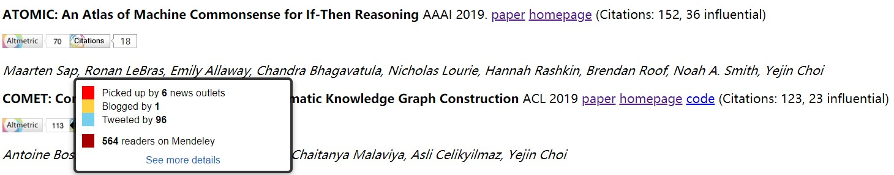

# commonsense-papers
Must-read papers on commonsense knowledge and others resources and tutorials

We aim to select the most representative and innovative papers in the research field of **commonsense knowledge**, and provide taxonomy/classification as well as statistics of these papers to give a quick overview of the field and help focused reading.

We've also added (influential) citation numbers according to [Semantic Scholar](https://www.semanticscholar.org/), [AltMetric Badge](http://api.altmetric.com/embeds.html) (paper influence in social media) and [Dimensions Badge](https://badge.dimensions.ai/) (paper citations) for **papers that can be linked to an arxiv id/DOI**. Highly influential papers should now be easier to identify, though we still encourage readers to read other papers that might have been overlooked. Due to rendering limitation, the badges are only visible on our [website](https://adapt-sjtu.github.io/commonsense-papers/). 

Contributed by [ADAPTers](https://adapt.seiee.sjtu.edu.cn/) (major efforts by Zhiling Zhang([@blmoistawinde](https://github.com/blmoistawinde)), Siyu Ren, Hongru Huang, Zelin Zhou, Yanzhu Guo)

Our list may not be complete. We will keep adding papers and improving it. [Contributions](CONTRIBUTING.md) are welcomed!

<h2 id="toc">Table of Contents</h2>

- [commonsense-papers](#commonsense-papers)
  - [Statistics](#statistics)
  - [Tutorial and Survey](#tutorial-and-survey)
  - [Resources and Evaluation](#resources-and-evaluation)
    - [Commonsense Knowledge Bases/Models](#commonsense-knowledge-basesmodels)
    - [Related Knowledge Bases](#related-knowledge-bases)
    - [Datasets and Benchmarks](#datasets-and-benchmarks)
    - [Evaluation and Probing](#evaluation-and-probing)
  - [Knowledge Mining (Knowledge Base Completion)](#knowledge-mining-knowledge-base-completion)
  - [Applications](#applications)
    - [natural language inference (NLI) and commonsense reasoning (CSR)](#natural-language-inference-nli-and-commonsense-reasoning-csr)
    - [Machine Reading Comprehension (MRC)](#machine-reading-comprehension-mrc)
    - [Generation](#generation)
    - [Question Answering (QA)](#question-answering-qa)
    - [Vision, Robotics, Multimodal, Grounding and Speech](#vision-robotics-multimodal-grounding-and-speech)

## Statistics

Total papers in this repo: <anchor id="cnt">59</anchor> .

**Research Keywords**

Non-stopping words in title, indicating the hot topics in this field.

<anchor id="keyword">
<table border="1" class="dataframe">
  <thead>
    <tr style="text-align: right;">
      <th></th>
      <th>count</th>
    </tr>
  </thead>
  <tbody>
    <tr>
      <th>reasoning</th>
      <td>13</td>
    </tr>
    <tr>
      <th>graph</th>
      <td>6</td>
    </tr>
    <tr>
      <th>sense</th>
      <td>5</td>
    </tr>
    <tr>
      <th>question</th>
      <td>5</td>
    </tr>
    <tr>
      <th>model</th>
      <td>5</td>
    </tr>
    <tr>
      <th>challenge</th>
      <td>5</td>
    </tr>
    <tr>
      <th>common</th>
      <td>5</td>
    </tr>
    <tr>
      <th>pre</th>
      <td>4</td>
    </tr>
    <tr>
      <th>story</th>
      <td>4</td>
    </tr>
    <tr>
      <th>answering</th>
      <td>4</td>
    </tr>
  </tbody>
</table>
</anchor>

 

**Researchers**

Most active researchers in this field

<anchor id="researcher">
<table border="1" class="dataframe">
  <thead>
    <tr style="text-align: right;">
      <th></th>
      <th>count</th>
    </tr>
  </thead>
  <tbody>
    <tr>
      <th><a href="https://www.semanticscholar.org/author/1699545">Yejin Choi</a></th>
      <td>14</td>
    </tr>
    <tr>
      <th><a href="https://www.semanticscholar.org/author/2691021">Antoine Bosselut</a></th>
      <td>7</td>
    </tr>
    <tr>
      <th><a href="https://www.semanticscholar.org/author/1857797">Chandra Bhagavatula</a></th>
      <td>7</td>
    </tr>
    <tr>
      <th><a href="https://www.semanticscholar.org/author/51583409">Bill Yuchen Lin</a></th>
      <td>6</td>
    </tr>
    <tr>
      <th><a href="https://www.semanticscholar.org/author/39227408">Ronan Le Bras</a></th>
      <td>5</td>
    </tr>
    <tr>
      <th><a href="https://www.semanticscholar.org/author/1384550891">Xiang Ren</a></th>
      <td>4</td>
    </tr>
    <tr>
      <th><a href="https://www.semanticscholar.org/author/2516777">Hannah Rashkin</a></th>
      <td>4</td>
    </tr>
    <tr>
      <th><a href="https://www.semanticscholar.org/author/144590225">Dan Roth</a></th>
      <td>4</td>
    </tr>
    <tr>
      <th><a href="https://www.semanticscholar.org/author/2729164">Maarten Sap</a></th>
      <td>4</td>
    </tr>
    <tr>
      <th><a href="https://www.semanticscholar.org/author/48212577">Hongming Zhang</a></th>
      <td>3</td>
    </tr>
  </tbody>
</table>
</anchor>

**Venues**

Just an estimation. May not be precise as arxiv papers may appear in other venues in the future.

<anchor id="venue">
<table border="1" class="dataframe">
  <thead>
    <tr style="text-align: right;">
      <th></th>
      <th>count</th>
    </tr>
  </thead>
  <tbody>
    <tr>
      <th>EMNLP</th>
      <td>12</td>
    </tr>
    <tr>
      <th>ACL</th>
      <td>11</td>
    </tr>
    <tr>
      <th>arxiv</th>
      <td>9</td>
    </tr>
    <tr>
      <th>AAAI</th>
      <td>5</td>
    </tr>
    <tr>
      <th>CIKM</th>
      <td>2</td>
    </tr>
  </tbody>
</table>
</anchor>

 

## Tutorial and Survey

**Recent Advances in Natural Language Inference: A Survey of Benchmarks, Resources, and Approaches** arxiv 2019 [paper](https://arxiv.org/pdf/1904.01172)

*Shane Storks, Qiaozi Gao, Joyce Y. Chai*

**T6: Commonsense Reasoning for Natural Language Processing.** ACL 2020. [slides and video](https://slideslive.com/38931667/t6-commonsense-reasoning-for-natural-language-processing)

*Antoine Bosselut, Dan Roth, Maarten Sap, Vered Shwartz, Yejin Choi*

[back to table of contents](#toc)

## Resources and Evaluation

### Commonsense Knowledge Bases/Models
 

**CYC: Toward programs with common sense** [data(OpenCyc)](https://github.com/asanchez75/opencyc) [homepage](https://www.cyc.com/)

**Commonsense causal reasoning between short texts** (CausalNet) KR 2016 [paper](http://www.cs.sjtu.edu.cn/~kzhu/papers/kzhu-copa.pdf) [homepage](https://adapt.seiee.sjtu.edu.cn/project_causal.html) [code](https://github.com/cs-zyluo/CausalNet)

*Zhiyi Luo, Yuchen Sha, Kenny Q. Zhu, Seung-won Hwang, Zhongyuan Wang*

**ConceptNet 5.5: an open multilingual graph of general knowledge** AAAI 2017. [paper](https://arxiv.org/pdf/1612.03975) [homepage](https://conceptnet.io/) [repo](https://github.com/commonsense/conceptnet5) [embedding(ConceptNet Numberbatch) repo](https://github.com/commonsense/conceptnet-numberbatch)

*Robyn Speer, Joshua Chin, Catherine Havasi*

**ATOMIC: An Atlas of Machine Commonsense for If-Then Reasoning** AAAI 2019. [paper](https://arxiv.org/pdf/1811.00146.pdf) [homepage](https://homes.cs.washington.edu/~msap/atomic/)

*Maarten Sap, Ronan LeBras, Emily Allaway, Chandra Bhagavatula, Nicholas Lourie, Hannah Rashkin, Brendan Roof, Noah A. Smith, Yejin Choi*

**COMET: Commonsense Transformers for Automatic Knowledge Graph Construction** ACL 2019 [paper](https://arxiv.org/abs/1906.05317) [homepage](https://mosaickg.apps.allenai.org/) [code](https://github.com/atcbosselut/comet-commonsense)

*Antoine Bosselut, Hannah Rashkin, Maarten Sap, Chaitanya Malaviya, Asli Celikyilmaz, Yejin Choi*

**ASER: A Large-scale Eventuality Knowledge Graph.** WWW 2020 [paper](https://arxiv.org/pdf/1905.00270) [homepage](https://hkust-knowcomp.github.io/ASER/) [code](https://github.com/HKUST-KnowComp/ASER)

*Hongming Zhang, Xin Liu, Haojie Pan, Yangqiu Song, Cane Wing-Ki Leung*

**Commonsense Properties from Query Logs and Question Answering Forums** (quasimodo) CIKM 2019 [paper](https://arxiv.org/pdf/1905.10989.pdf) [homepage](https://www.mpi-inf.mpg.de/departments/databases-and-information-systems/research/yago-naga/commonsense/quasimodo/) [code](https://github.com/Aunsiels/CSK)

*Julien Romero, Simon Razniewski, Koninika Pal, Jeff Z. Pan, Archit Sakhadeo, Gerhard Weikum*

**TransOMCS: From Linguistic Graphs to Commonsense Knowledge**  IJCAI 2020 [paper](https://arxiv.org/pdf/2005.00206) [homepage](https://hkust-knowcomp.github.io/ASER/) [code](https://github.com/HKUST-KnowComp/TransOMCS)

*Hongming Zhang, Daniel Khashabi, Yangqiu Song, Dan Roth*

**Paragraph-Level Commonsense Transformers with Recurrent Memory** (PARA-COMeT) arxiv 2020 [paper](https://arxiv.org/pdf/2010.01486)

*Saadia Gabriel, Chandra Bhagavatula, Vered Shwartz, Ronan Le Bras, Maxwell Forbes, Yejin Choi*

**COMET-ATOMIC 2020: On Symbolic and Neural Commonsense Knowledge Graphs** arxiv 2020 [paper](https://arxiv.org/pdf/2010.05953.pdf)

*Jena D. Hwang, Chandra Bhagavatula, Ronan Le Bras, Jeff Da, Keisuke Sakaguchi, Antoine Bosselut, Yejin Choi*

**CommonGen: A Constrained Text Generation Challenge for Generative Commonsense Reasoning** EMNLP 2020 Findings [paper](https://arxiv.org/pdf/1911.03705) [homepage](https://inklab.usc.edu/CommonGen/index.html)

*Bill Yuchen Lin, Wangchunshu Zhou, Ming Shen, Pei Zhou, Chandra Bhagavatula, Yejin Choi, Xiang Ren*

### Related Knowledge Bases
 

**WordNet: A Lexical Database for English** Communications of the ACM Vol. 38, No. 11: 39-41. 1995. [homepage](https://wordnet.princeton.edu/)

*George A. Miller*

**Toward an Architecture for Never-Ending Language Learning** (NELL). AAAI 2010 [paper](http://rtw.ml.cmu.edu/papers/carlson-aaai10.pdf) [homepage](http://rtw.ml.cmu.edu/rtw/)

*Andrew Carlson, Justin Betteridge, Bryan Kisiel, Burr Settles, Estevam R. Hruschka Jr., and Tom M. Mitchell*

**DBpedia – A Large-scale, Multilingual Knowledge Base Extracted from Wikipedia**. Semantic Web 2012 [paper](http://svn.aksw.org/papers/2013/SWJ_DBpedia/public.pdf) [homepage](https://wiki.dbpedia.org/)

*Jens Lehmann, Robert Isele, Max Jakob, Anja Jentzsch, Dimitris Kontokostas, Pablo N. Mendes, Sebastian Hellmann, Mohamed Morsey, Patrick van Kleef, Sören Auer, Christian Bizer*

### Datasets and Benchmarks
 

**A Corpus and Cloze Evaluation for Deeper Understanding of Commonsense Stories** (Story Cloze Test) NAACL 2016 [paper](https://www.aclweb.org/anthology/N16-1098.pdf) [homepage](https://cs.rochester.edu/nlp/rocstories/)

*Nasrin Mostafazadeh, Nathanael Chambers, Xiaodong He, Devi Parikh, Dhruv Batra, Lucy Vanderwende, Pushmeet Kohli, James Allen*

**Modeling Naive Psychology of Characters in Simple Commonsense Stories** ACL 2018 [paper](https://arxiv.org/pdf/1805.06533) [homepage](https://uwnlp.github.io/storycommonsense/)

*Hannah Rashkin, Antoine Bosselut, Maarten Sap, Kevin Knight, Yejin Choi*

**SemEval-2018 Task 11: Machine Comprehension Using Commonsense Knowledge** SemEval 2018 [paper](https://www.aclweb.org/anthology/S18-1119.pdf)

*Simon Ostermann, Michael Roth, Ashutosh Modi, Stefan Thater, Manfred Pinkal*

**Reasoning about Actions and State Changes by Injecting Commonsense Knowledge** (ProPara) EMNLP 2018 [paper](https://arxiv.org/pdf/1808.10012) [code](https://github.com/allenai/propara)

*Niket Tandon, Bhavana Dalvi Mishra, Joel Grus, Wen-tau Yih, Antoine Bosselut, Peter Clark*

**CommonSenseqa: A question answering challenge targeting commonsense knowledge** NAACL 2019 [paper](https://arxiv.org/abs/1811.00937) [homepage](https://www.tau-nlp.org/commonsenseqa) [code](https://github.com/jonathanherzig/commonsenseqa)

*Alon Talmor, Jonathan Herzig, Nicholas Lourie, Jonathan Berant*

**From Recognition to Cognition: Visual Commonsense Reasoning** CVPR 2019 [paper](http://openaccess.thecvf.com/content_CVPR_2019/papers/Zellers_From_Recognition_to_Cognition_Visual_Commonsense_Reasoning_CVPR_2019_paper.pdf) [code](https://github.com/rowanz/r2c/) [homepage](http://visualcommonsense.com/)

*Rowan Zellers, Yonatan Bisk, Ali Farhadi, Yejin Choi*

**oLMpics -- On what Language Model Pre-training Captures** arxiv 2019 [paper](https://arxiv.org/pdf/1912.13283.pdf) [code](https://github.com/alontalmor/oLMpics) [homepage](https://github.com/alontalmor/oLMpics)

*Alon Talmor, Yanai Elazar, Yoav Goldberg, Jonathan Berant*

**ABDUCTIVE COMMONSENSE REASONING** (ART) ICLR 2020 [paper](https://arxiv.org/pdf/1908.05739) [homepage](http://abductivecommonsense.xyz/)

*Chandra Bhagavatula, Ronan Le Bras, Chaitanya Malaviya, Keisuke Sakaguchi, Ari Holtzman, Hannah Rashkin, Doug Downey, Scott Wen-tau Yih, Yejin Choi*

**PIQA: Reasoning about Physical Commonsense in Natural Language** AAAI 2020 [paper](https://arxiv.org/pdf/1911.11641.pdf) [homepage](https://yonatanbisk.com/piqa/)

*Yonatan Bisk, Rowan Zellers, Ronan Le Bras, Jianfeng Gao, Yejin Choi*

**Reasoning about Goals, Steps, and Temporal Ordering with WikiHow** EMNLP 2020 [paper](https://arxiv.org/pdf/2009.07690) [code](https://github.com/zharry29/wikihow-goal-step)

*Qing Lyu, Li Zhang, Chris Callison-Burch*

**Birds have four legs?! NumerSense: Probing Numerical Commonsense Knowledge of Pre-trained Language Models** EMNLP 2020 [paper](https://arxiv.org/pdf/2005.00683.pdf) [homepage](https://inklab.usc.edu/NumerSense/)

*Bill Yuchen Lin, Seyeon Lee, Rahul Khanna and Xiang Ren*

**A Review of Winograd Schema Challenge Datasets and Approaches** arxiv 2020 [paper](https://arxiv.org/abs/2004.13831)

*Vid Kocijan, Thomas Lukasiewicz, Ernest Davis, Gary Marcus, Leora Morgenstern*

[back to table of contents](#toc)

### Evaluation and Probing

**Reporting Bias and Knowledge Acquisition** AKBC 2013 [paper](https://urresearch.rochester.edu/fileDownloadForInstitutionalItem.action?itemId=27832&itemFileId=142662)

*Jonathan Gordon, Benjamin Van Durme*

**Do Neural Language Representations Learn Physical Commonsense?** CogSci 2019 [paper](https://arxiv.org/pdf/1908.02899.pdf) [code](https://github.com/mbforbes/physical-commonsense)

*Maxwell Forbes, Ari Holtzman, Yejin Choi*

**How Reasonable are Common-Sense Reasoning Tasks: A Case-Study on the Winograd Schema Challenge and SWAG** EMNLP 2019 [paper](https://arxiv.org/pdf/1811.01778)

*Paul Trichelair, Ali Emami, Adam Trischler, Kaheer Suleman, Jackie Chi Kit Cheung*

**Joint Reasoning for Multi-Faceted Commonsense Knowledge** AKBC 2020 [paper](https://arxiv.org/pdf/2001.04170.pdf) [homepage](https://dice.mpi-inf.mpg.de/)

*Yohan Chalier, Simon Razniewski, Gerhard Weikum*

**Does BERT Solve Commonsense Task via Commonsense Knowledge?** arxiv 2020 [paper](https://arxiv.org/pdf/2008.03945)

*Leyang Cui, Sijie Cheng, Yu Wu, Yue Zhang*

**WinoWhy: A Deep Diagnosis of Essential Commonsense Knowledge for Answering Winograd Schema Challenge** ACL 2020 [paper](https://arxiv.org/pdf/2005.05763) [code](https://github.com/HKUST-KnowComp/WinoWhy)

*Hongming Zhang, Xinran Zhao, Yangqiu Song*

[back to table of contents](#toc)

## Knowledge Mining (Knowledge Base Completion)

**Automatic Extraction of Commonsense LocatedNear Knowledge** ACL 2018 [paper](https://arxiv.org/pdf/1711.04204) [code](https://github.com/adapt-sjtu/commonsense-locatednear)

*Frank F. Xu, Bill Yuchen Lin, Kenny Q. Zhu*

**Commonsense Knowledge Mining from Pretrained Models** EMNLP 2019 [paper](https://www.aclweb.org/anthology/D19-1109.pdf)

*Joe Davison, Joshua Feldman, Alexander Rush*

**Language Models as Knowledge Bases?** EMNLP 2019 [paper](https://arxiv.org/pdf/1909.01066.pdf) [code](https://github.com/facebookresearch/LAMA)

*Fabio Petroni, Tim Rocktäschel, Patrick Lewis, Anton Bakhtin, Yuxiang Wu, Alexander H. Miller, Sebastian Riedel*

**Commonsense Knowledge Base Completion with Structural and Semantic Context** AAAI 2020 [paper](https://arxiv.org/pdf/1910.02915) [code](https://github.com/allenai/commonsense-kg-completion)

*Chaitanya Malaviya, Chandra Bhagavatula, Antoine Bosselut, Yejin Choi*

**Temporal Common Sense Acquisition with Minimal Supervision** ACL 2020 [paper](https://arxiv.org/pdf/2005.04304.pdf)

*Ben Zhou, Qiang Ning, Daniel Khashabi, Dan Roth*

**Learning Physical Common Sense as Knowledge Graph Completion via BERT Data Augmentation and Constrained Tucker Factorization** EMNLP 2020 [paper](https://www.aclweb.org/anthology/2020.emnlp-main.266.pdf)

*Zhenjie Zhao, Evangelos Papalexakis, Xiaojuan Ma*

[back to table of contents](#toc)

## Applications

### natural language inference (NLI) and commonsense reasoning (CSR)
 

**Neural natural language inference models enhanced with external knowledge** ACL 2018 [paper](https://arxiv.org/abs/1711.04289) [code](https://github.com/lukecq1231/kim)
- resource: WordNet

*Qian Chen, Xiaodan Zhu, Zhen-Hua Ling, Diana Inkpen, Si Wei*

**Incorporating Structured Commonsense Knowledge in Story Completion** AAAI 2019 [paper](https://www.aaai.org/ojs/index.php/AAAI/article/download/5183/5055)
- resource: ConceptNet Numberbatch

*Jiaao Chen, Jianshu Chen, Zhou Yu*

**Contrastive Self-Supervised Learning for Commonsense Reasoning** ACL 2020 [paper](https://arxiv.org/pdf/2005.00669.pdf) [code](https://github.com/SAP-samples/acl2020-commonsense/)

*Tassilo Klein, Moin Nabi*

**Do Language Embeddings Capture Scales?** EMNLP Findings 2020 [paper](https://arxiv.org/pdf/2010.05345) [code](https://github.com/google-research-datasets/numbert)

*Xikun Zhang, Deepak Ramachandran, Ian Tenney, Yanai Elazar, Dan Roth*

**Differentiable Open-Ended Commonsense Reasoning** arxiv 2020 [paper](https://arxiv.org/pdf/2010.14439)

*Bill Yuchen Lin, Haitian Sun, Bhuwan Dhingra, Manzil Zaheer, Xiang Ren, William W. Cohen*

**Pre-training Text-to-Text Transformers for Concept-centric Common Sense** arxiv 2020 [paper](https://arxiv.org/pdf/2011.07956) [code](https://anonymous.4open.science/r/6fdeed55-ec2c-4ffa-aee8-0cc3b7f5ade5/)

*Wangchunshu Zhou, Dong-Ho Lee, Ravi Kiran Selvam, Seyeon Lee, Bill Yuchen Lin, Xiang Ren*

**Enhanced Story Representation by ConceptNet for Predicting Story Endings** CIKM 2020 [paper](https://dl.acm.org/doi/abs/10.1145/3340531.3417466) [code](https://github.com/shanshan437421/Simplification)

*Shanshan Huang, Kenny Q. Zhu, Qianzi Liao, Libin Shen and Yinggong Zhao*

### Machine Reading Comprehension (MRC)
 

**Enhancing Pre-Trained Language Representations with Rich Knowledge for Machine Reading Comprehension** ACL 2019 [paper](https://www.aclweb.org/anthology/P19-1226.pdf) [code](https://github.com/PaddlePaddle/Research/tree/master/NLP/ACL2019-KTNET)
- resource: WordNet, NELL

*An Yang, Quan Wang, Jing Liu, Kai Liu, Yajuan Lyu, Hua Wu, Qiaoqiao She, Sujian Li*

### Generation
 

**Diverse and Informative Dialogue Generation with Context-Specific Commonsense Knowledge Awareness** ACL 2020 [paper](https://www.aclweb.org/anthology/2020.acl-main.515.pdf) [code](https://github.com/pku-orangecat/ACL2020-ConKADI)
- resource: ConceptNet

*Sixing Wu, Ying Li, Dawei Zhang, Yang Zhou, Zhonghai Wu*

**Language Generation with Multi-Hop Reasoning on Commonsense Knowledge Graph** EMNLP 2020 [paper](https://arxiv.org/pdf/2009.11692.pdf)
- resource: ConceptNet

*Haozhe Ji, Pei Ke, Shaohan Huang, Furu Wei, Xiaoyan Zhu, Minlie Huang*

### Question Answering (QA)
 

**Dynamic Knowledge Graph Construction for Zero-shot Commonsense Question Answering** arxiv 2019 [paper](https://arxiv.org/pdf/1911.03876)
- resource: COMET

*Antoine Bosselut, Yejin Choi*

**Adversarial Training for Commonsense Inference** ACL 2020 RepL4NLP workshop [paper](https://arxiv.org/pdf/2005.08156)

*Lis Pereira, Xiaodong Liu, Fei Cheng, Masayuki Asahara, Ichiro Kobayashi*

**Unsupervised Commonsense Question Answering with Self-Talk** EMNLP 2020 [paper](https://arxiv.org/pdf/2004.05483) [code](https://github.com/vered1986/self_talk)
- resource: ConceptNet, COMET, Google N-grams

*Vered Shwartz, Peter West, Ronan Le Bras, Chandra Bhagavatula, Yejin Choi*

**Scalable Multi-Hop Relational Reasoning for Knowledge-Aware Question Answering** EMNLP 2020 [paper](https://arxiv.org/pdf/2005.00646) [code](https://github.com/INK-USC/MHGRN)

*Yanlin Feng, Xinyue Chen, Bill Yuchen Lin, Peifeng Wang, Jun Yan, Xiang Ren*

### Vision, Robotics, Multimodal, Grounding and Speech

 

**Enabling Robots to Understand Incomplete Natural Language Instructions Using Commonsense Reasoning** ICRA 2020 [paper](https://arxiv.org/pdf/1904.12907)

*Haonan Chen; Hao Tan; Alan Kuntz; Mohit Bansal; Ron Alterovitz*

**Visual Commonsense R-CNN** CVPR 2020 [paper](https://openaccess.thecvf.com/content_CVPR_2020/papers/Wang_Visual_Commonsense_R-CNN_CVPR_2020_paper.pdf) [code](https://github.com/Wangt-CN/VC-R-CNN)

*Tan Wang, Jianqiang Huang, Hanwang Zhang, Qianru Sun*

[back to table of contents](#toc)